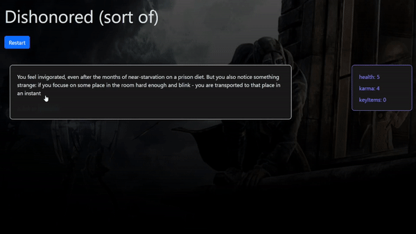

# RPG Engine

A web-based RPG engine written in React enabling users to play out a story written in a json file, with:
- story branch-out (theoretically arbitrary graph of storypoints)
- (optional) keeping track of variables, as well as storypoint triggers for those variables
- (optional) randomized result of choices

Currently, there is only a single example of a JSON story which is based on the *Dishonored* videogame (with significant alterations)

## Story Features
- `title`: string title of the story
- `variables`: initialization of variables used in the story
- `varTriggerEvents`: list of triggers for storypoints (the storypoint is started if a variable reaches the specified value)
- `storypoint`: this is the basic building block of a story; 
  - `texts`: a list of strings to displayed one after another 
  - `prompt`: a string to be displayed before the choices
  - `choices`: a list choices (each containing text, success rate of choice, changes to variables as well as references to the next storypoint)

The structure is a bit more complicated - you can examine the example `dishonored_story.json` for details 

## Usage
1. Put your story in a JSON file into "src/assets"
2. Update the import in the "src/App.jsx" file: 
   `import story from './assets/YOUR_STORY.json';`
3. Run `npm install` to install the required packages
4. Run `npm run dev` in the console, and the result should be hosted locally